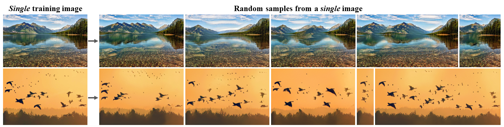

# SinGAN

[Project](https://tamarott.github.io/SinGAN.htm) | [Arxiv](https://arxiv.org/pdf/1905.01164.pdf) | [CVF](http://openaccess.thecvf.com/content_ICCV_2019/papers/Shaham_SinGAN_Learning_a_Generative_Model_From_a_Single_Natural_Image_ICCV_2019_paper.pdf) | [Supplementary materials](https://openaccess.thecvf.com/content_ICCV_2019/supplemental/Shaham_SinGAN_Learning_a_ICCV_2019_supplemental.pdf) | [Talk (ICCV`19)](https://youtu.be/mdAcPe74tZI?t=3191) 
### Official pytorch implementation of the paper: "SinGAN: Learning a Generative Model from a Single Natural Image"
#### ICCV 2019 Best paper award (Marr prize)


## Random samples from a *single* image
With SinGAN, you can train a generative model from a single natural image, and then generate random samples from the given image, for example:




## SinGAN's applications
SinGAN can be also used for a line of image manipulation tasks, for example:
 
This is done by injecting an image to the already trained model. See section 4 in our [paper](https://arxiv.org/pdf/1905.01164.pdf) for more details.


### Citation
If you use this code for your research, please cite our paper:

```
@inproceedings{rottshaham2019singan,
  title={SinGAN: Learning a Generative Model from a Single Natural Image},
  author={Rott Shaham, Tamar and Dekel, Tali and Michaeli, Tomer},
  booktitle={Computer Vision (ICCV), IEEE International Conference on},
  year={2019}
}
```

## Code

### Install dependencies

```
python -m pip install -r requirements.txt
```

This code was tested with python 3.6, torch 1.4

Please note: the code currently only supports torch 1.4 or earlier because of the optimization scheme.

For later torch versions, you may try this repository: https://github.com/kligvasser/SinGAN (results won't necessarily be identical to the official implementation).


###  Train
To train SinGAN model on your own image, put the desired training image under Input/Images, and run

```
python main_train.py --input_name <input_file_name>
```

This will also use the resulting trained model to generate random samples starting from the coarsest scale (n=0).

To run this code on a cpu machine, specify `--not_cuda` when calling `main_train.py`

###  Random samples
To generate random samples from any starting generation scale, please first train SinGAN model on the desired image (as described above), then run 

```
python random_samples.py --input_name <training_image_file_name> --mode random_samples --gen_start_scale <generation start scale number>
```

pay attention: for using the full model, specify the generation start scale to be 0, to start the generation from the second scale, specify it to be 1, and so on. 

###  Random samples of arbitrary sizes
To generate random samples of arbitrary sizes, please first train SinGAN model on the desired image (as described above), then run 

```
python random_samples.py --input_name <training_image_file_name> --mode random_samples_arbitrary_sizes --scale_h <horizontal scaling factor> --scale_v <vertical scaling factor>
```

###  Animation from a single image

To generate short animation from a single image, run

```
python animation.py --input_name <input_file_name> 
```

This will automatically start a new training phase with noise padding mode.

###  Harmonization

To harmonize a pasted object into an image (See example in Fig. 13 in [our paper](https://arxiv.org/pdf/1905.01164.pdf)), please first train SinGAN model on the desired background image (as described above), then save the naively pasted reference image and it's binary mask under "Input/Harmonization" (see saved images for an example). Run the command

```
python harmonization.py --input_name <training_image_file_name> --ref_name <naively_pasted_reference_image_file_name> --harmonization_start_scale <scale to inject>

```

Please note that different injection scale will produce different harmonization effects. The coarsest injection scale equals 1. 

###  Editing

To edit an image, (See example in Fig. 12 in [our paper](https://arxiv.org/pdf/1905.01164.pdf)), please first train SinGAN model on the desired non-edited image (as described above), then save the naive edit as a reference image under "Input/Editing" with a corresponding binary map (see saved images for an example). Run the command

```
python editing.py --input_name <training_image_file_name> --ref_name <edited_image_file_name> --editing_start_scale <scale to inject>

```
both the masked and unmasked output will be saved.
Here as well, different injection scale will produce different editing effects. The coarsest injection scale equals 1. 

###  Paint to Image

To transfer a paint into a realistic image (See example in Fig. 11 in [our paper](https://arxiv.org/pdf/1905.01164.pdf)), please first train SinGAN model on the desired image (as described above), then save your paint under "Input/Paint", and run the command

```
python paint2image.py --input_name <training_image_file_name> --ref_name <paint_image_file_name> --paint_start_scale <scale to inject>

```
Here as well, different injection scale will produce different editing effects. The coarsest injection scale equals 1. 

Advanced option: Specify quantization_flag to be True, to re-train *only* the injection level of the model, to get a on a color-quantized version of upsampled generated images from the previous scale. For some images, this might lead to more realistic results.

### Super Resolution
To super resolve an image, please run:
```
python SR.py --input_name <LR_image_file_name>
```
This will automatically train a SinGAN model correspond to 4x upsampling factor (if not exist already).
For different SR factors, please specify it using the parameter `--sr_factor` when calling the function.
SinGAN's results on the BSD100 dataset can be download from the 'Downloads' folder.

## Additional Data and Functions

### Single Image Fréchet Inception Distance (SIFID score)
To calculate the SIFID between real images and their corresponding fake samples, please run:
```
python SIFID/sifid_score.py --path2real <real images path> --path2fake <fake images path> 
```  
Make sure that each of the fake images file name is identical to its corresponding real image file name. Images should be saved in `.jpg` format.

### Super Resolution Results
SinGAN's SR results on the BSD100 dataset can be download from the 'Downloads' folder.

### User Study
The data used for the user study can be found in the Downloads folder. 

real folder: 50 real images, randomly picked from the [places database](http://places.csail.mit.edu/)

fake_high_variance folder: random samples starting from n=N for each of the real images 

fake_mid_variance folder: random samples starting from n=N-1 for each of the real images 

For additional details please see section 3.1 in our [paper](https://arxiv.org/pdf/1905.01164.pdf)
